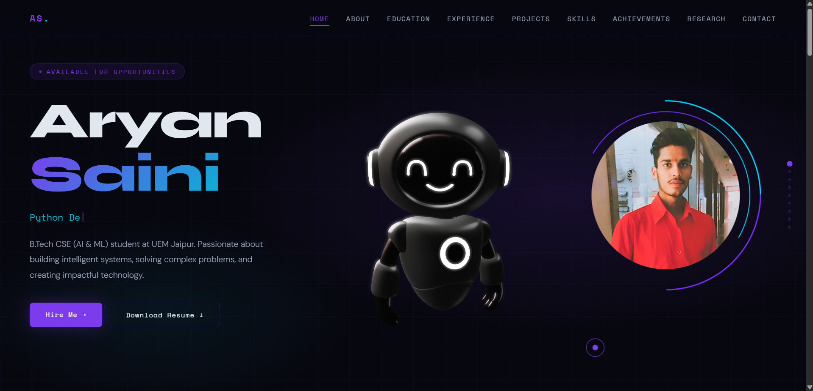
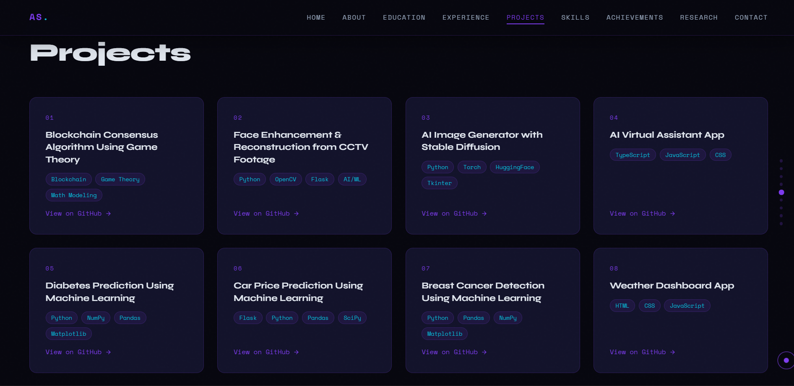

# 🚀 Aryan Saini Portfolio

## 🏠 Portfolio Preview

### Home Page



### Portfolio Overview



---

## 👨‍💻 About Me

Hi, I'm **Aryan Saini**, a passionate **AI/ML Engineer, Python Developer, and Frontend Developer** currently pursuing **B.Tech in Computer Science Engineering (Artificial Intelligence & Machine Learning)** at the **University of Engineering & Management, Jaipur**.

I enjoy building intelligent systems, solving real-world problems, and developing innovative software solutions.

---

## 🌟 Features

* ✨ Modern Futuristic UI Design
* 📱 Fully Responsive Layout
* 🤖 Interactive 3D Elements
* 🎬 Animated Hero Section
* 🧠 AI/ML Focused Portfolio
* 💼 Project Showcase
* 🎓 Education Timeline
* 📄 Research Publication Section
* ⚡ Skills Visualization
* 📧 Contact Form with EmailJS
* 📄 Resume Download Functionality

---

## 🛠️ Tech Stack

### Frontend

* HTML5
* CSS3
* JavaScript

### Libraries & Services

* Typed.js
* EmailJS
* Spline 3D

### Development Tools

* Git
* GitHub
* VS Code

---

## 🎓 Education

### Bachelor of Technology (CSE - AI & ML)

**University of Engineering & Management, Jaipur**

📅 2023 – 2027

📊 Current CGPA: **8.4**

---

### Senior Secondary Education

**Shri Kalyan Shiksha Niketan Sr. Sec. School**

* Class 10: 86%
* Class 12: 69%

---

## 💼 Experience

### Android Developer Virtual Internship

**Google for Developers × EduSkills**

### AI/ML Virtual Internship

**AWS Academy × EduSkills**

### AI/ML Virtual Internship

**Google for Developers × EduSkills**

### Content Writing Internship

**InAmigos Foundation**

---

## 🚀 Projects

### Blockchain Consensus Algorithm Using Game Theory

* Blockchain Technology
* Game Theory
* Distributed Systems

### Face Enhancement & Reconstruction from CCTV Footage

* Python
* OpenCV
* Flask
* Deep Learning

### AI Image Generator with Stable Diffusion

* Python
* Hugging Face
* Stable Diffusion

### AI Virtual Assistant Application

* JavaScript
* TypeScript
* CSS

### Diabetes Prediction Using Machine Learning

* Machine Learning
* Python
* Pandas
* NumPy

### Car Price Prediction Using Machine Learning

* Regression Models
* Data Analysis
* Flask

### Breast Cancer Detection Using Machine Learning

* Classification Models
* Data Science

### Weather Dashboard Application

* HTML
* CSS
* JavaScript

---

## 📄 Research Publication

### Provenance Tracking, Universal Scoring, and Token-Based Incentive Mechanism Enabled AI Model Marketplace

Research Areas:

* Artificial Intelligence
* Decentralized AI Ecosystems
* AI Marketplace Architecture
* Provenance Tracking
* Universal Scoring Systems
* Token-Based Incentive Mechanisms

---

## 📂 Project Structure

```bash
aryan-saini-portfolio/
│
├── index.html
├── README.md
│
├── assets/
│   ├── css/
│   │   └── styles.css
│   │
│   ├── js/
│   │   └── main.js
│   │
│   ├── img/
│   │   └── Photo AS.jpeg
│   │
│   ├── pdf/
│   │   └── Resume Aryan Saini.pdf
│   │
│   ├── portfolio-home.png
│   └── portfolio-projects.png
```

---

## ⚙️ Installation

Clone Repository

```bash
git clone https://github.com/Aryan132005/aryan-saini-portfolio.git
```

Move into project directory

```bash
cd aryan-saini-portfolio
```

Run Locally

```bash
Open index.html
```

or

```bash
Use VS Code Live Server
```

---

## 📫 Connect With Me

📧 Email: [aryansaini132005@gmail.com](mailto:aryansaini132005@gmail.com)

🐙 GitHub: https://github.com/Aryan132005

💼 LinkedIn: https://linkedin.com/in/aryan-saini-3618472a1

📍 Jaipur, Rajasthan, India

---

## ⭐ Support

If you like this project, please consider giving it a ⭐ on GitHub.

---

<div align="center">

### Made with ❤️ by Aryan Saini

### AI/ML Engineer • Python Developer • Frontend Developer

</div>